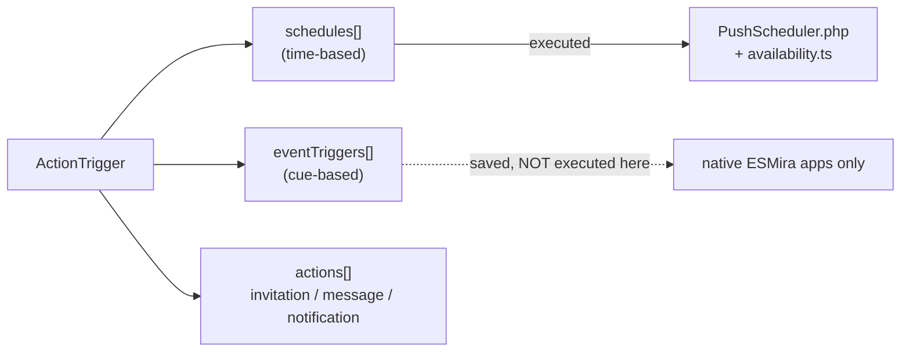

# Scheduling

A questionnaire has `actionTriggers[]`. Each **action trigger** combines a **when** with an **action**:

The designer creates **one schedule or one event per trigger**, although the data model allows more.

## Schedules {/* #schedules */}

Shipped

| Field | Meaning |
| --- | --- |
| `dailyRepeatRate` | Every N days. |
| `skipFirstInLoop` | Wait N days before the first occurrence. |
| `startDayOne` | Start on the join day. |
| `weekdays` | Bitmask (Sunday = bit 0); `0` means all days. |
| `dayOfMonth` | `0` = all, or 1–31. |
| `userEditable` | Participant may change the times. |
| `signalTimes[]` | One or more times per day, see below. |

### Signal times

- **Fixed:** a single `startTimeOfDay`.
- **Random:** within `startTimeOfDay`–`endTimeOfDay`, `frequency` times per day with at least
  `minutesBetween` minutes apart. `randomFixed` chooses whether the random points are drawn **once for the whole
  study** or **re-drawn** each time. The designer warns if the window cannot fit `frequency × minutesBetween`.

Several signal times per day give **multi-point daily sampling**, the basis for capturing diurnal
trajectories. Shipped

`Study.legacyScheduling` switches day offsets from calendar days to 24-hour periods.

### Actions

| `type` | Name | Behaviour |
| --- | --- | --- |
| 1 | Invitation | Notification inviting to the questionnaire; supports `reminder_count` and `reminder_delay_minu`. |
| 2 | Message | Message to the participant. |
| 3 | Simple notification | Plain notification. |

Only types 1 and 3 produce a Web Push.

### Where schedules run in this fork

| Layer | Component | Role |
| --- | --- | --- |
| Server | `PushScheduler::computeDueOccurrences` | Builds due occurrences each minute, in the participant's local time (stored `tzOffset`). Honours `dailyRepeatRate`, weekdays, day of month, `skipFirstInLoop`, and the duration fields. |
| Client | `web-pwa/src/lib/availability.ts` | Computes when a questionnaire is open or locked, and why, re-evaluated every 60 s. |
| Service worker | `sw.ts` | Drops notifications that are stale, done or duplicated before showing them. |

Details: [Web Push](./web-push.md), [Participant flow](../pwa/participant-flow.md#availability).

## Event triggers {/* #event-triggers */}

Partial Configurable, not executed.

An event trigger is a **cue**, not a free-form condition. The designer's `cueCode` options are exactly:

`actions_executed`, `invitation`, `invitation_missed`, `joined`, `quit`, `questionnaire`, `rejoined`,
`reminder`, `schedule_changed`, `statistic_viewed`, `study_message`, `study_updated`.

Plus a delay (fixed, or random between `delayMinimumSec` and `delaySec`), "skip this questionnaire"
(only events from other questionnaires), and an optional filter to events from one specific questionnaire.

:::warning[Not executed by this fork's web path]
A search of `src/backend`, `src/api`, `src/cli` and `web-pwa/src` found **no code that fires event
triggers**. `PushScheduler` skips event-triggered questionnaires in its window-opening pass, and the PWA has no
executor. Event execution is a behaviour of ESMira's native apps, which this repository does not contain.
This is an inference from reading the code; it has not been tested end to end.
:::

There is **no general "if-this-then-that" condition builder**. The `Conditions` structure (key, value,
equal/unequal/greater/less, AND/OR) is used only for chart axes, not scheduling.

TBC Event-contingent and adaptive designs: see
[Roadmap](../roadmap.md#event-contingent-execution).

## Questionnaire filters and availability windows

Independent of triggers, a questionnaire can be limited by `durationStart`/`durationEnd`,
`durationStartingAfterDays`, `durationPeriodDays`, `completableOnce`, `completableOncePerDay` (fork),
`completableOncePerNotification` with `completableMinutesAfterNotification`,
`completableAtSpecificTime`, and `limitCompletionFrequency`. A questionnaire with **no signals** is
*passive* and is gated only by its duration fields.
