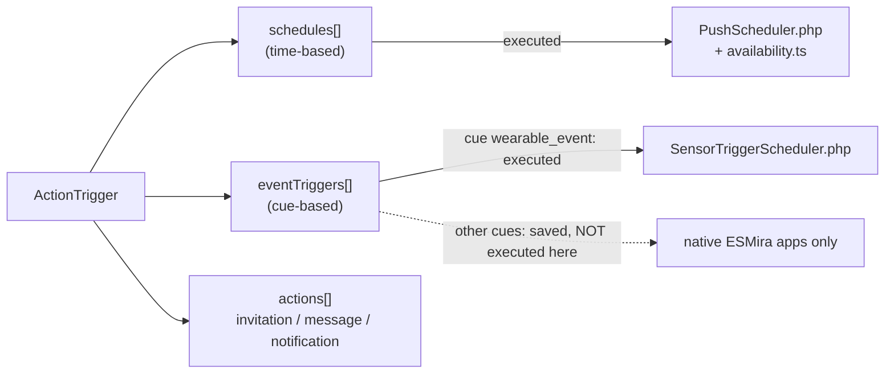

# Scheduling

A questionnaire has `actionTriggers[]`. Each **action trigger** combines a **when** with an **action**:

The designer creates **one schedule or one event (or sensor trigger) per trigger**, although the data model allows more.

## Schedules {/* #schedules */}

Shipped

| Field | Meaning |
| --- | --- |
| `dailyRepeatRate` | Every N days. |
| `skipFirstInLoop` | Wait N days before the first occurrence. |
| `startDayOne` | Start on the join day. |
| `weekdays` | Bitmask (Sunday = bit 0); `0` means all days. |
| `dayOfMonth` | `0` = all, or 1–31. |
| `userEditable` | Participant may change the times. |
| `signalTimes[]` | One or more times per day, see below. |

### Signal times

- **Fixed:** a single `startTimeOfDay`.
- **Random:** within `startTimeOfDay`–`endTimeOfDay`, `frequency` times per day with at least
  `minutesBetween` minutes apart. `randomFixed` chooses whether the random points are drawn **once for the whole
  study** or **re-drawn** each time. The designer warns if the window cannot fit `frequency × minutesBetween`.

Several signal times per day give **multi-point daily sampling**, the basis for capturing diurnal
trajectories. Shipped

`Study.legacyScheduling` switches day offsets from calendar days to 24-hour periods.

### Actions

| `type` | Name | Behaviour |
| --- | --- | --- |
| 1 | Invitation | Notification inviting to the questionnaire; supports `reminder_count` and `reminder_delay_minu`. |
| 2 | Message | Message to the participant. |
| 3 | Simple notification | Plain notification. |

Only types 1 and 3 produce a Web Push.

### Where schedules run in this fork

| Layer | Component | Role |
| --- | --- | --- |
| Server | `PushScheduler::computeDueOccurrences` | Builds due occurrences each minute, in the participant's local time (stored `tzOffset`). Honours `dailyRepeatRate`, weekdays, day of month, `skipFirstInLoop`, and the duration fields. |
| Client | `web-pwa/src/lib/availability.ts` | Computes when a questionnaire is open or locked, and why, re-evaluated every 60 s. |
| Service worker | `sw.ts` | Drops notifications that are stale, done or duplicated before showing them. |

Details: [Web Push](./web-push.md), [Participant flow](../pwa/participant-flow.md#availability).

## Sensor triggers {/* #sensor-triggers */}

Partial Implemented end to end; **not yet tested against live
Withings or Fitbit accounts** (unit-tested scheduling logic only).

*If the wearable reports new data, then send the prompt; otherwise send it at a fixed time anyway.* Add one
with **Add sensor trigger** in the questionnaire's *Filter and trigger* section (or pick *Wearable sensor event*
as the cue of an event trigger).

| Setting | Meaning |
| --- | --- |
| Provider | `any` connected wearable, `withings` or `fitbit`. (`googlehealth` exists in the backend as a hidden, untested placeholder; see [Wearables](./wearables.md#google-health-api).) |
| New data of type | `sleep`, `activity`, `weight`, `blood_pressure` (Withings only), `ecg` (Withings only). The designer warns when the chosen provider has no webhook for the type. |
| Only within a daily window | Ignore events outside `wearableWindowStart`–`wearableWindowEnd` (participant-local; may wrap midnight), e.g. 05:00–12:00 for a wake-up prompt. |
| Max. prompts per day | `wearableMaxPerDay` (default 1) per participant and local day. |
| Delay | The existing delay fields: fixed, or a stable pseudo-random value between `delayMinimumSec` and `delaySec`. |
| Fallback | `fallbackEnabled` + `fallbackTimeOfDay`: at that local time, send the prompt if no qualifying event arrived earlier that day. This also covers participants who never linked a device. |

Behaviour worth knowing:

- The fallback **counts against the daily cap**: a sensor event that arrives after the fallback fired does not
  prompt a second time (with the default cap of 1).
- Reminders (`reminder_count`, `reminder_delay_minu`) follow a sensor or fallback prompt and stop once the
  participant submits anything.
- Prompts older than **2 hours** are dropped rather than sent (no back-filling after downtime). On a
  participant's first run, a fallback time that already passed is skipped too; a fresh sensor event is not.
- The daily cap counts on the day the prompt is *shown* (after any delay), not the day the sensor reported.
- The PWA treats a questionnaire that has only sensor triggers as always available, so a "complete by" time
  shown in the notification (`completableOncePerNotification`) is not enforced in the app.
- The questionnaire's own duration fields (start/end date, activation and expiry days after joining) still apply.
- Delivery is by **Web Push** only, from the same per-minute sender as time-based schedules, and needs push
  enabled for the study.
- A webhook says only that *new data of a category exists*. There is **no value condition** (for example
  "slept under six hours") and no real wake-up detection; "new sleep data synced" is the proxy.

Server setup and the webhook endpoint: [Wearables](./wearables.md#webhooks-and-sensor-triggers).

## Event triggers {/* #event-triggers */}

Partial Configurable, not executed (except the sensor cue above).

An event trigger is a **cue**, not a free-form condition. The designer's `cueCode` options are exactly:

`actions_executed`, `invitation`, `invitation_missed`, `joined`, `quit`, `questionnaire`, `rejoined`,
`reminder`, `schedule_changed`, `statistic_viewed`, `study_message`, `study_updated`, and, added by this fork,
`wearable_event` (see above).

Plus a delay (fixed, or random between `delayMinimumSec` and `delaySec`), "skip this questionnaire"
(only events from other questionnaires), and an optional filter to events from one specific questionnaire.

:::warning[Not executed by this fork's web path]
Apart from `wearable_event`, a search of `src/backend`, `src/api`, `src/cli` and `web-pwa/src` found **no code
that fires event triggers**. `PushScheduler` skips event-triggered questionnaires in its window-opening pass, and the PWA has no
executor. Event execution is a behaviour of ESMira's native apps, which this repository does not contain.
This is an inference from reading the code; it has not been tested end to end.
:::

There is **no general "if-this-then-that" condition builder**: the sensor trigger is a fixed *event + window + cap + fallback* form. The `Conditions` structure (key, value,
equal/unequal/greater/less, AND/OR) is used only for chart axes, not scheduling.

TBC Event-contingent and adaptive designs: see
[Current status](../current-status.md).

## Questionnaire filters and availability windows

Independent of triggers, a questionnaire can be limited by `durationStart`/`durationEnd`,
`durationStartingAfterDays`, `durationPeriodDays`, `completableOnce`, `completableOncePerDay` (fork),
`completableOncePerNotification` with `completableMinutesAfterNotification`,
`completableAtSpecificTime`, and `limitCompletionFrequency`. A questionnaire with **no signals** is
*passive* and is gated only by its duration fields.
