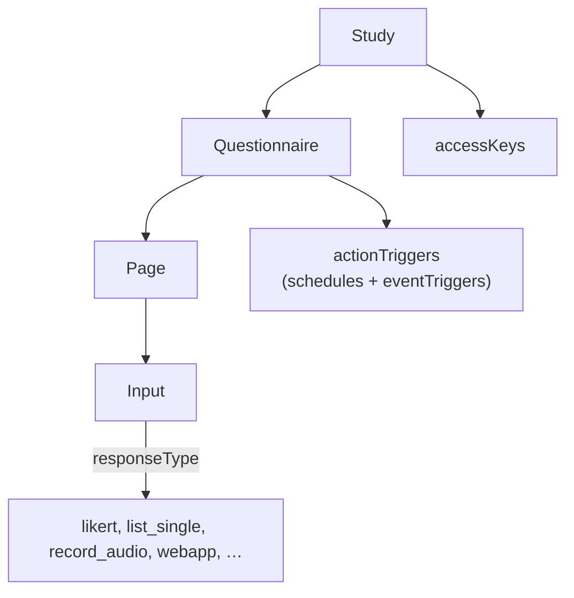

# Study model

A **study** contains **questionnaires**; a questionnaire contains **pages**; a page contains **inputs**
(questions). Triggers (when to prompt) hang off the questionnaire; see [Scheduling](./scheduling.md).

## Study

Key fields: `id`, `version`, `lang` / `langCodes` / `defaultLang`, `published` (per platform), `studyOver`,
`accessKeys[]` (the invite codes), `randomGroups`, `enableRewardSystem`, `sendMessagesAllowed`,
`publicStatistics` / `personalStatistics`, and translatable texts (title, description, informed consent
form, FAQ, contact email, reward instructions).

### Fork-added study fields

| Field | Purpose | Designer UI |
| --- | --- | --- |
| `webPushEnabled` | Turn on Web Push reminders | [Push panel](./web-push.md) |
| `wearablesEnabled`, `wearablesProviders` | Offer wearable linking, restricted to chosen providers | [Wearables panel](./wearables.md) |
| `wearablesDataTypes` | Narrow the synced data types | **None**, source-edit only |
| `enableTutorialMode`, `tutorialOffer`, `tutorialIntro` | Practice runs in the PWA | Study settings |
| `enablePersonalCharts`, `chartsVisibleOnlyAfterStudy` | Personal chart options | Study settings |
| `studyArtwork` | Invite-page cover (uploaded, or generated by `ProceduralCover.ts`) | Study description |

## Questionnaire and page

Questionnaire: `title`, `pages[]`, `actionTriggers[]`, `sumScores[]`, completion/duration filters, optional
Merlin script blocks. Page: `header`, `footer`, `randomized`, `skipAfterSecs`, `relevance`, `inputs[]`.

### Fork-added questionnaire fields

| Field | Effect |
| --- | --- |
| `completableOncePerDay` | Locks the questionnaire after a completion until the next scheduled day (passive ones reopen at midnight). Enforced in the PWA, not by the server. |
| `changeResponseMode` | `previous` (default), `any`, or `none`: which earlier answers a participant may change. |
| `notificationIncludeDeadline` | Appends "Complete by HH:MM" to the push text. |

Existing upstream filters: start/end date, activation and expiry N days after joining, completable once,
completable within X minutes of a notification, minimum gap between completions, completable only in a time
window, script filter, group availability.

## Input types

ESMira defines 28 `responseType` values. Types the **PWA renders** are marked in the right column.

| `responseType` | PWA | Notes |
| --- | --- | --- |
| `likert`, `binary`, `list_single`, `list_multiple`, `number`, `date`, `time`, `duration`, `va_scale`, `text_input` | Yes | Classic inputs. |
| `text`, `image` | Yes | Shown as information bubbles; not answered. |
| `record_audio` | Yes | Voice memo. Shipped |
| `record_keystrokes` | Yes | **Fork-added.** Typing fallback. |
| `webapp` | Yes | **Fork-added.** Embedded cognitive task. |
| `photo`, `video` | No | Types exist in the data model; the PWA drops them. |
| `ambient_light`, `app_usage`, `battery_level`, `bluetooth_devices`, `compass`, `countdown`, `location`, `noise_level`, `file_upload`, `dynamic_input`, `share` | No | Sensor, native-app or special types; the designer marks several as web-incompatible. |

Fork-added input fields: `description` (shown as muted "Explanation" text), `webappDescription`,
`maxLength` (audio cap, seconds) and `minLength` (typing floor). `maxLength` and `minLength` have no
designer field today; they are settable only in the study source.

### New response columns

For `record_keystrokes`, `ResponsesIndex.php` creates three columns: `<name>`, `<name>~text` and
`<name>~capture_mode`, and the keystroke log is uploaded as a CSV into `media/keystrokes/`. Details in
[PWA question types](../pwa/question-types.md#keystroke-fallback).

## Web-only mode {/* #web-only-mode */}

`webOnlyMode` (server config, fork-added) tells the designer that the server serves the web/PWA path only. It
greys out Android/iOS publish toggles and native-only features, and `index.php` swaps in the iEMAbot header
logo and footer. Shipped

## Merlin scripting

ESMira's Merlin scripts power `relevance`, `textScript`, end-of-questionnaire script blocks and script
filters. The designer flags them web-incompatible; the PWA does **not** run Merlin. It translates only
simple `relevance` expressions, see [Relevance conditions](../pwa/question-types.md#relevance-conditions).
