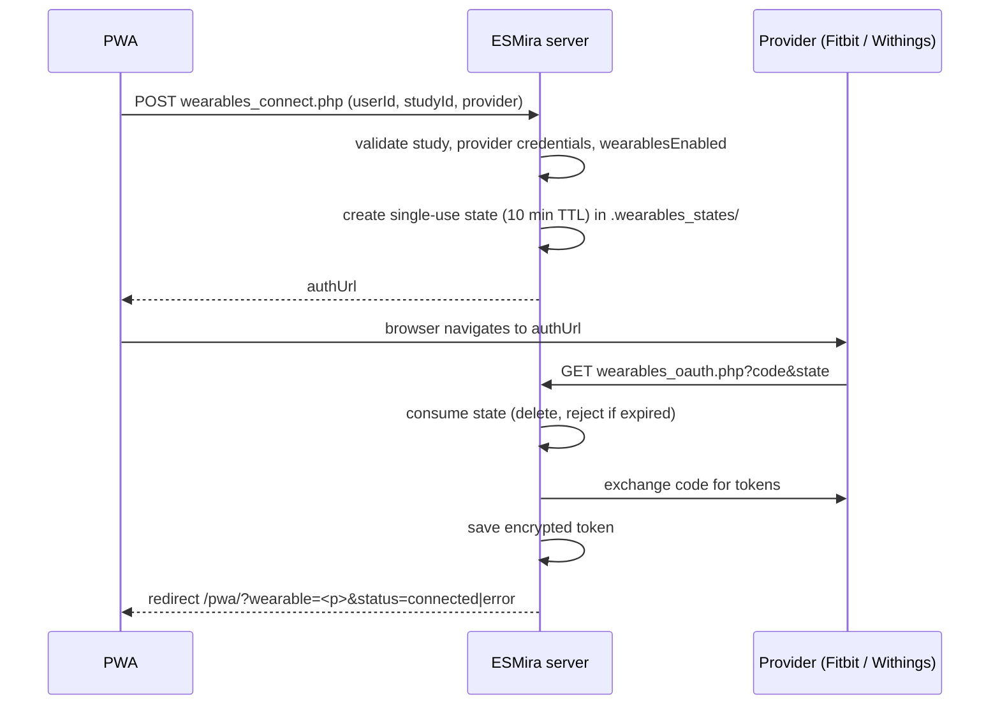

# Wearables

<span className="status status--shipped">Shipped</span> ingestion and export · fork-only
<span className="status status--tbc">TBC</span> using the data to trigger or tailor prompts

Participants can link a consumer wearable to a study. The server pulls their data on a schedule and stores it
for the researcher.

:::caution[What this feature does *not* do]
Wearable data is **stored and exported only**. No code uses it to trigger, schedule or contextualise a
survey, and there is no wake-up detection. The sync is hourly and fetches *completed days only*, so data is
typically a day old. See [Current status](../current-status.md).
:::

## Providers and data

| Provider | Data types fetched by default |
| --- | --- |
| **Fitbit** | activity (steps; 1-minute intraday with a daily fallback on HTTP 403), heart rate, sleep, weight, SpO₂, HRV, breathing rate |
| **Withings** | weight, blood pressure, activity, sleep (summary), ECG |

`Study.wearablesDataTypes` can narrow the list, but **no designer UI sets it**; use the study source. If it is
empty, or does not intersect the provider's list, the provider defaults apply.

## Server configuration

Credentials are server-wide, set with the CLI:

```bash
php cli/wearables_setup.php genkey                                  # token-encryption key
php cli/wearables_setup.php <fitbit|withings> <client_id> <client_secret> [redirect_uri]
```

| Config key | Purpose |
| --- | --- |
| `wearables_<provider>_client_id` / `_client_secret` | OAuth application credentials. |
| `wearables_token_key` | 32-byte base64 key for token encryption. |
| `wearables_redirect_uri` | Optional; default `scheme://host/<api dir>/wearables_oauth.php`. |
| `wearables_pwa_path` | Optional; where to send the browser back (default `/pwa`). |

There is **no environment-variable support** for these keys. The researcher panel shows the exact redirect
URI to register with each provider.

## OAuth 2.0 flow



- The `state` is `bin2hex(random_bytes(24))`, stored server-side with study, user and provider, and is
  single-use. It is **not bound to a browser cookie** and **PKCE is not used**.
- Scopes are requested together, not per data type: Withings `user.info,user.metrics,user.activity,user.sleepevents`;
  Fitbit `activity heartrate sleep weight profile settings oxygen_saturation respiratory_rate temperature
  nutrition`.
- Both authorization URLs send `prompt=login`.

## Token storage

One file per study, participant and provider:
`studies/<id>/.wearables_tokens/<userId>.<provider>`.

- Payload: JSON encrypted with libsodium `secretbox`, stored as `v1:` + base64(nonce + ciphertext).
- **Fallback:** if the `sodium` extension or key is missing, tokens are stored as `p0:` + **plaintext JSON**.
  The Docker image installs `sodium`, and `genkey` creates the key.
- Tokens refresh when under 5 minutes remain; the new refresh token is written immediately because Withings
  refresh tokens are single-use.
- The **client secret** and the token key are stored in plaintext in the server config file.

## Sync

The image runs `cli/wearables_sync.php` **hourly** (`0 * * * *`).

| Behaviour | Value |
| --- | --- |
| What is fetched | Whole completed **UTC days up to yesterday** |
| First run | Backfills 1 day |
| Catch-up cap | 14 days |
| Skipped when | `wearablesEnabled` is false, or provider not in a non-empty `wearablesProviders` |

## Stored data

`studies/<id>/.wearables_data/<userId>.<provider>.csv` with a `.state` cursor beside it. Append-only,
all fields quoted, server delimiter (default `;`):

```text
userId ; provider ; measurement_time ; data_type ; value ; fetched_at
```

`value` is the **raw provider JSON, verbatim**. Wearable CSVs are not encrypted on disk.

## Researcher panel

Source: `sections/wearables.tsx`.

- Enable toggle (`wearablesEnabled`).
- Provider checkboxes, disabled when the server has no credentials, each with a connected-participant count.
- A read-only box with the **redirect URI** to register.
- A **`wearables.zip`** download (read permission); the same link appears in the data list.

There is no per-participant view, data preview or data-type selector.

## Participant flow and disconnect

The PWA shows a *Wearables* tile only when the study has wearables enabled **and** at least one of its
providers is configured on the server. *Connect* navigates to the provider; *Disconnect* calls
`wearables_disconnect.php`, which deletes the local token, data CSV and cursor for that provider.

## Known limitations

- **No provider-side revocation:** disconnect does not revoke the token at the provider.
- **Weak endpoint authentication:** `wearables_status.php` and `wearables_disconnect.php` check only
  `studyId` + `userId`.
- **Empty provider list mismatch:** the server treats an empty `wearablesProviders` as "all allowed"; the PWA
  treats it as "none offered".
- **Reset study does not clear wearable or push folders** (`emptyStudy`).
- **Delete behaviour of wearable folders on study deletion** was not verified.
