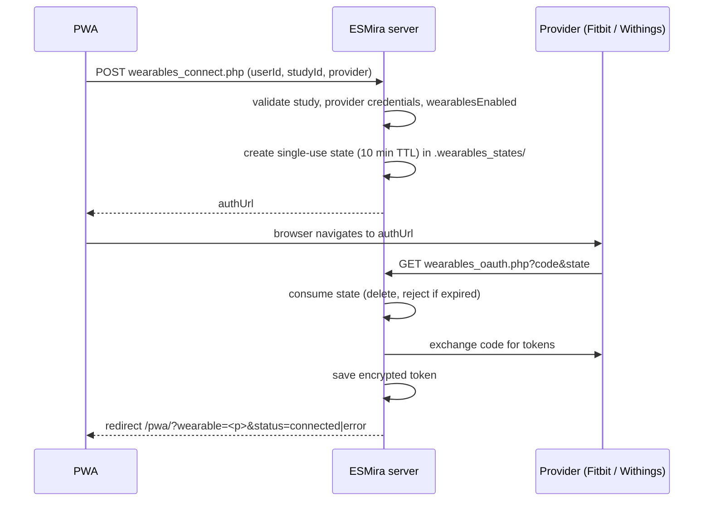
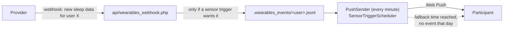

# Wearables

<span className="status status--shipped">Shipped</span> ingestion and export · fork-only
<span className="status status--partial">Partial</span> webhook-triggered prompts for Withings and Fitbit (untested against live providers; Google Health is an untested placeholder)
<span className="status status--tbc">TBC</span> tailoring prompts from measurement values

Participants can link a consumer wearable to a study. The server pulls their data on a schedule and stores it
for the researcher, and can use provider webhooks to trigger prompts.

:::caution[What this feature does *not* do]
Measurement data is **stored and exported only**. The hourly sync fetches *completed days only*, so it is
typically a day old, and no code reads the values to decide anything. Prompts can be triggered by a webhook
saying *new data of a type arrived*, see [Webhooks and sensor triggers](#webhooks-and-sensor-triggers). There
is no value threshold and no real wake-up detection. See [Current status](../current-status.md).
:::

## Providers and data

| Provider | Data types fetched by default |
| --- | --- |
| **Fitbit** | activity (steps; 1-minute intraday with a daily fallback on HTTP 403), heart rate, sleep, weight, SpO₂, HRV, breathing rate |
| **Withings** | weight, blood pressure, activity, sleep (summary), ECG |

`Study.wearablesDataTypes` can narrow the list, but **no designer UI sets it**; use the study source. If it is
empty, or does not intersect the provider's list, the provider defaults apply.

## Server configuration

Credentials are server-wide, set with the CLI:

```bash
php cli/wearables_setup.php genkey                                  # token-encryption key
php cli/wearables_setup.php <fitbit|withings> <client_id> <client_secret> [redirect_uri]
```

| Config key | Purpose |
| --- | --- |
| `wearables_<provider>_client_id` / `_client_secret` | OAuth application credentials. |
| `wearables_token_key` | 32-byte base64 key for token encryption. |
| `wearables_redirect_uri` | Optional; default `scheme://host/<api dir>/wearables_oauth.php`. |
| `wearables_pwa_path` | Optional; where to send the browser back (default `/pwa`). |

There is **no environment-variable support** for these keys. The researcher panel shows the exact redirect
URI to register with each provider.

## OAuth 2.0 flow



- The `state` is `bin2hex(random_bytes(24))`, stored server-side with study, user and provider, and is
  single-use. It is **not bound to a browser cookie** and **PKCE is not used**.
- Scopes are requested together, not per data type: Withings `user.info,user.metrics,user.activity,user.sleepevents`;
  Fitbit `activity heartrate sleep weight profile settings oxygen_saturation respiratory_rate temperature
  nutrition`.
- Both authorization URLs send `prompt=login`.

## Token storage

One file per study, participant and provider:
`studies/<id>/.wearables_tokens/<userId>.<provider>`.

- Payload: JSON encrypted with libsodium `secretbox`, stored as `v1:` + base64(nonce + ciphertext).
- **Fallback:** if the `sodium` extension or key is missing, tokens are stored as `p0:` + **plaintext JSON**.
  The Docker image installs `sodium`, and `genkey` creates the key.
- Tokens refresh when under 5 minutes remain; the new refresh token is written immediately because Withings
  refresh tokens are single-use.
- The **client secret** and the token key are stored in plaintext in the server config file.

## Sync

The image runs `cli/wearables_sync.php` **hourly** (`0 * * * *`).

| Behaviour | Value |
| --- | --- |
| What is fetched | Whole completed **UTC days up to yesterday** |
| First run | Backfills 1 day |
| Catch-up cap | 14 days |
| Skipped when | `wearablesEnabled` is false, or provider not in a non-empty `wearablesProviders` |

## Stored data

`studies/<id>/.wearables_data/<userId>.<provider>.csv` with a `.state` cursor beside it. Append-only,
all fields quoted, server delimiter (default `;`):

```text
userId ; provider ; measurement_time ; data_type ; value ; fetched_at
```

`value` is the **raw provider JSON, verbatim**. Wearable CSVs are not encrypted on disk.

## Webhooks and sensor triggers {/* #webhooks-and-sensor-triggers */}

<span className="status status--partial">Partial</span> Not yet verified against live Withings or Fitbit accounts.



| Provider | Registration | Authentication of the callback | Types |
| --- | --- | --- | --- |
| **Withings** (Notify) | Automatic when the participant links: the server subscribes each type via `notify` with a URL carrying a key derived from the client secret. | Key in the URL (`k=`); Withings does not sign requests. | sleep (44), activity (16), weight (1), blood pressure (4), ECG (54) |
| **Fitbit** (Subscriptions) | Register the subscriber endpoint `…/api/wearables_webhook.php?provider=fitbit` and a verification code in the Fitbit developer console; the server creates the per-user subscriptions on linking. Store the code with `php cli/wearables_setup.php fitbit-verify <code>`. | `X-Fitbit-Signature` HMAC-SHA1 over the raw body, keyed with `client_secret&`. | sleep, activities, body (weight) |

Optional config key `wearables_webhook_uri` overrides the auto-derived public callback URL (needed behind a
proxy that rewrites the host or path). Participants who linked **before** this feature was deployed have no
webhook subscription until they re-link.

**Only these providers have webhooks.** Oura is supported for data sync but has no sensor-trigger support
here, and the designer offers only *Any connected wearable*, *Withings* and *Fitbit* (Google Health is hidden). The data types below are
the complete set the designer offers, each checked against the provider's own documentation (2026-10-09):

| Designer type | Withings `appli` | Fitbit collection | Google Health data types |
| --- | --- | --- | --- |
| Sleep | 44 (sleep summary) | `sleep` | `sleep` |
| Activity | 16 (steps, distance, workouts) | `activities` | `steps`, `distance`, `floors`, `active-minutes`, `active-zone-minutes`, `exercise` |
| Weight / body | 1 (weight and body composition) | `body` | `weight`, `body-fat` |
| Blood pressure | 4 (blood pressure and heart rate) | not available | not available |
| ECG | 54 (ECG measurement) | not available | not available (ECG data exists, but has no webhook) |

Sources: [Google Health webhooks](https://developers.google.com/health/webhooks), [Withings notification content](https://oauth.withings.com/developer-guide/v3/data-api/notifications/notification-content/),
[Fitbit: Using subscriptions](https://dev.fitbit.com/build/reference/web-api/developer-guide/using-subscriptions/).
Other categories exist (Withings bed-in/bed-out sleep-mat events 50/51, HRV 62, glucose 58; Fitbit `foods`) but
are deliberately not offered. Withings bed-out (51) would be a closer wake-up signal than "sleep summary
synced", for owners of a sleep mat, and could be added.

:::warning[Fitbit legacy Web API ends on 2026-10-30]
Fitbit's documentation states that support for the legacy Fitbit Web API ends on 2026-09-30 and the API is
**turned off on 2026-10-30**, with Google Health API as the replacement (new project onboarding was paused when
last checked). This affects the *whole* Fitbit provider in ESMira (OAuth linking, hourly sync and these
webhooks), not only sensor triggers. Fitbit webhook triggers are therefore usable only until that date; a
migration to the Google Health API, which uses a different subscription and signature scheme, has not been done.
Withings is unaffected. Google Health, below, is the replacement path.
:::

:::note[Unverified: Fitbit request signature]
The `X-Fitbit-Signature` check (HMAC-SHA1 of the raw body, key `client_secret&`, Base64) follows a third-party
description of Fitbit's webhooks. Fitbit's own "Using subscriptions" page refers to a separate *Subscriber
Security* section that was not checked. Confirm against a real notification before relying on it; if the check
rejects genuine notifications, Fitbit receives 404s and may disable the endpoint.
:::

### Google Health API

<span className="status status--tbc">TBC</span> Untested placeholder code.

:::danger[Experimental, untested placeholder]
This provider was written from Google's documentation alone and has **never been run against a real Google Cloud
project, token, or webhook**: when it was written Google stated *"we are not onboarding new projects at this
time"*. Treat it as a starting point that will need changes once access exists, not as a working feature. The
designer and researcher panel do **not offer it** (switch `SHOW_GOOGLE_HEALTH` in
`data/study/EventTrigger.ts`, currently `false`), so the backend below is dormant until that is flipped; a study
that already names `googlehealth` in its source still renders. The CLI labels it "experimental, untested". It is
inert until you configure it, and should not be relied on for a study.
:::

Trigger path only.

| | Fitbit (legacy) | Google Health |
| --- | --- | --- |
| Sign-in | Fitbit OAuth; Basic auth on the token call | Google OAuth 2.0; credentials in the body; `access_type=offline` + `prompt=consent` for a refresh token; 1 h access tokens |
| User id | In the token response | Not in it; `GET /v4/users/me/identity` right after sign-in (`healthUserId`). `ACCOUNT_NOT_LINKED` (no Google Health profile) aborts the link. |
| Webhook registration | Per participant, per collection | **Once per server**, as a "subscriber" with `AUTOMATIC` subscriptions; nothing happens at link time |
| Callback check | Verify code, GET | Two POSTs `{"type":"verification"}`: with the secret expect 2xx, without it 401/403 |
| Authenticity | HMAC-SHA1 (unconfirmed) | Secret in `Authorization` **and** an ECDSA P-256 signature (`GOOGLE-HEALTH-API-SIGNATURE`, Tink prefix) against Google's published keyset |
| Delivery | List per request | Batches of up to 99; must answer 204 at once; retried for 7 days, so events can repeat (harmless: the cap and ledger absorb them) |

Setup:

```bash
php cli/wearables_setup.php googlehealth <client_id> <client_secret>   # OAuth client from your Google Cloud project
php cli/wearables_setup.php googlehealth-webhook                        # creates the webhook secret, prints the subscriber request
```

Send the printed request to `https://health.googleapis.com/v4beta/projects/<PROJECT NUMBER>/subscribers?subscriberId=esmira`
(project *number*, not id; needs the `health.subscribers.create` permission). The OAuth redirect URI is the same
`wearables_oauth.php` shown in the researcher panel.

What is and is not done:

- Requested scopes: `sleep.readonly`, `activity_and_fitness.readonly`, `health_metrics_and_measurements.readonly`
  (the three Google's webhook page ties to sleep, activity and weight; its scope page gives no per-type mapping).
- **Measurement data is not downloaded**, so a Google Health participant adds no rows to `wearables.zip`; the
  hourly sync skips the provider.
- Linking Google Health removes the participant's legacy Fitbit *token* (Google forbids holding both); already
  collected Fitbit data stays, and the token is not revoked at Fitbit.
- Unverified: whether Google's scopes count as sensitive/restricted (affecting app verification, and whether a
  project in *Testing* mode, whose refresh tokens expire, is enough), and the exact notification envelope. The
  parser accepts the plausible shapes. If genuine notifications are rejected with 403, set the server config key
  `wearables_googlehealth_skip_signature` to bypass the signature check (the secret stays required).
- The webhook route must receive the `Authorization` header. Under Apache with PHP-FPM/CGI that needs
  `SetEnvIf Authorization "(.*)" HTTP_AUTHORIZATION=$1` or an equivalent rewrite.

- The endpoint answers 200/204 quickly (Fitbit requires a 204 within 5 seconds). A bad Withings key gets 403; a bad Fitbit signature or verification
  code gets 404.
- The callback maps the provider's user id to participants by scanning the token files, then stores an event
  **only** for studies that have wearables enabled and a sensor trigger for that provider and type. The event
  is the time the webhook arrived, kept for three days; it contains no measurement.
- Subscription is best effort: if it fails, linking still succeeds and the trigger's time fallback is what
  fires. An incomplete subscription is written to the server error log.
- Disconnecting the last linked device deletes the participant's event log.
- The Withings callback URL carries one key shared by all participants and appears in web server access logs;
  anyone who learns it can forge events for a Withings user id. Keep query strings out of access logs, and note
  that rotating the Withings client secret invalidates existing subscriptions (participants must re-link).
- Fitbit subscription IDs are derived per user and collection, as Fitbit requires them to be unique per stream.
- Ceilings: the provider decides when to call the webhook (devices must sync first), so latency is not under
  ESMira's control.

Designer settings and exact semantics: [Scheduling](./scheduling.md#sensor-triggers).

## Researcher panel

Source: `sections/wearables.tsx`.

- Enable toggle (`wearablesEnabled`).
- Provider checkboxes, disabled when the server has no credentials, each with a connected-participant count.
- A read-only box with the **redirect URI** to register.
- A **`wearables.zip`** download (read permission); the same link appears in the data list.

There is no per-participant view, data preview, data-type selector or webhook status display. Sensor triggers are
configured per questionnaire in the trigger editor, not here.

## Participant flow and disconnect

The PWA shows a *Wearables* tile only when the study has wearables enabled **and** at least one of its
providers is configured on the server. *Connect* navigates to the provider; *Disconnect* calls
`wearables_disconnect.php`, which deletes the local token, data CSV and cursor for that provider.

## Known limitations

- **No provider-side revocation:** disconnect does not revoke the token at the provider.
- **Weak endpoint authentication:** `wearables_status.php` and `wearables_disconnect.php` check only
  `studyId` + `userId`.
- **Empty provider list mismatch:** the server treats an empty `wearablesProviders` as "all allowed"; the PWA
  treats it as "none offered".
- **Reset study does not clear wearable or push folders** (`emptyStudy`).
- **Delete behaviour of wearable folders on study deletion** was not verified.
