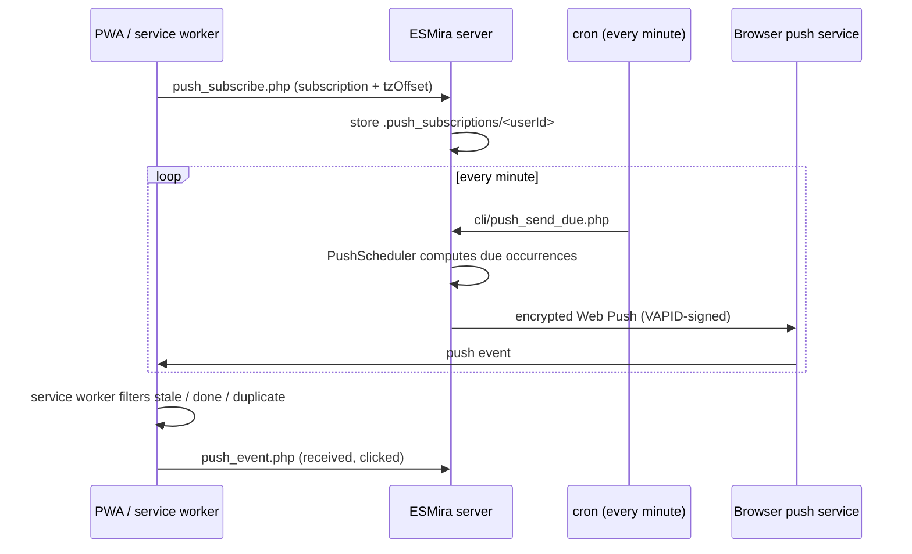

# Web Push notifications

<span className="status status--shipped">Shipped</span> · fork-only

Upstream's web client has no reminders. This fork adds server-side **Web Push** so the installed PWA can be
nudged at the times defined by the study's [schedules](./scheduling.md#schedules).



## Setup

1. **Generate VAPID keys** once per server:
   ```bash
   php cli/generate_vapid.php          # add --force to rotate
   ```
   This writes `vapid_public_key`, `vapid_private_key` and `vapid_subject` (default `mailto:noreply@esmira`)
   into the server config. Set a real contact address as the subject for production.
2. **Install dependencies:** the Dockerfile installs `gmp`, `mbstring`, `curl` and Composer's
   `minishlink/web-push` (`^9.0`).
3. **Cron:** the image installs a per-minute job running `cli/push_send_due.php`
   (see [Docker and cron](../deployment/docker-and-cron.md)).
4. **Enable per study:** tick *Web Push* in the study's Push panel (`webPushEnabled`).

The public key reaches the PWA through `api/studies.php`.

## Subscription flow

`web-pwa/src/lib/push.ts` waits for the service worker (up to 8 s), recreates the subscription if the
server's application key changed, and posts it to `push_subscribe.php`. The server stores
`{userId, subscription, tzOffset, created}` under `.push_subscriptions/<userId>`. The timezone offset comes
from `Date#getTimezoneOffset()` and is refreshed on each visit with permission granted, so scheduling follows
the participant's local clock.

## How the scheduler decides what to send

`PushSender::run` iterates studies with `webPushEnabled` and, per subscriber, keeps a state file
(`cursor`, `realized`, `sent`). The **first run sets the cursor to "now"**: there is no backfill.

| Source of an occurrence | Behaviour |
| --- | --- |
| Fixed signal time | `startTimeOfDay` in participant-local time. |
| Random signal window | `frequency` times sampled once per day and persisted in `realized`. |
| Reminders | `reminder_count` repeats, each `reminder_delay_minu` after the base time. |
| "Window opened" | For questionnaires with `completableAtSpecificTime` and no signals. |
| Deadline text | "Complete by HH:MM" when `notificationIncludeDeadline` is set. |

Honoured schedule fields: `dailyRepeatRate`, weekdays, `dayOfMonth`, `skipFirstInLoop`,
`durationStartingAfterDays`, `durationPeriodDays`, `durationStart`, `durationEnd`. Only actions of type
1 (invitation) and 3 (simple notification) are pushed. **Event triggers are not processed.**

Pushes are **coalesced to one per participant per run**, share the constant tag `esmira-reminder` with
`renotify`, and a 48-hour ledger keyed `type:qid:ts` prevents duplicates.

## Suppressing reminders {/* #suppressing-reminders */}

A reminder for something already done is noise, so it is suppressed on both sides.

**Server:** a reminder is skipped if `lastDataSetTime >= base time`. This is a **study-wide** heuristic, not
per questionnaire.

**Service worker (`sw.ts`)** drops an item when any of these hold:

- its deadline has passed;
- it was completed since the window started;
- it is `completableOnce` and already completed;
- it is `completableOncePerDay` and was completed earlier the same local day;
- it is `completableOncePerNotification` and that occurrence is done;
- it was already shown in the last 48 hours.

If nothing remains, **no notification is shown**. Completions are read from an IndexedDB mirror
(`completionMirror.ts`) because the worker cannot read `localStorage`. If several items remain, the body uses
a `%d` count template.

## Researcher panel

Requires **write** permission. Source: `sections/pushNotifications.tsx`.

| Element | Detail |
| --- | --- |
| Enable toggle | `webPushEnabled`. |
| Subscribers | Count, with a warning if no VAPID key is configured. |
| Reach | Installed-as-PWA vs in-browser counts, and device split (mobile/tablet/desktop) from `client_info.php`. |
| Sender heartbeat | Warns if the cron sender last ran more than 180 s ago, or never. |
| Funnel | sent → arrived → opened, plus failed; 14-day series; per-participant table (first 100). |
| Test push | To all subscribers, or to one participant. |

## Participant self-test

During onboarding, and from *Settings → Notifications not working?*, the PWA calls `push_test.php`, which
sends a server-generated welcome push to the caller's own subscription (falling back to a local
notification). The onboarding then asks "Did the notification arrive?".

## Failure handling

After a send, subscriptions answering HTTP **404/410** are deleted. Other failures are logged as `failed`
events in `.push_events` (JSONL).

## Known limitations

- **Welcome-push answers are discarded.** `push_event.php` accepts `welcome_confirmed` / `welcome_missed`, but
  `PushEvents` persists only `sent`, `failed`, `received` and `clicked`.
- **Suppression on the server is study-wide**, not per questionnaire.
- **Reliability is the platform's.** iOS requires installing to the Home Screen; Android battery
  optimisation can delay delivery. The PWA's own help text recommends the native ESMira app for the most
  reliable reminders.
- **Telemetry has no separate consent step.** Push funnel and client-info events are recorded for any
  subscribed participant.
