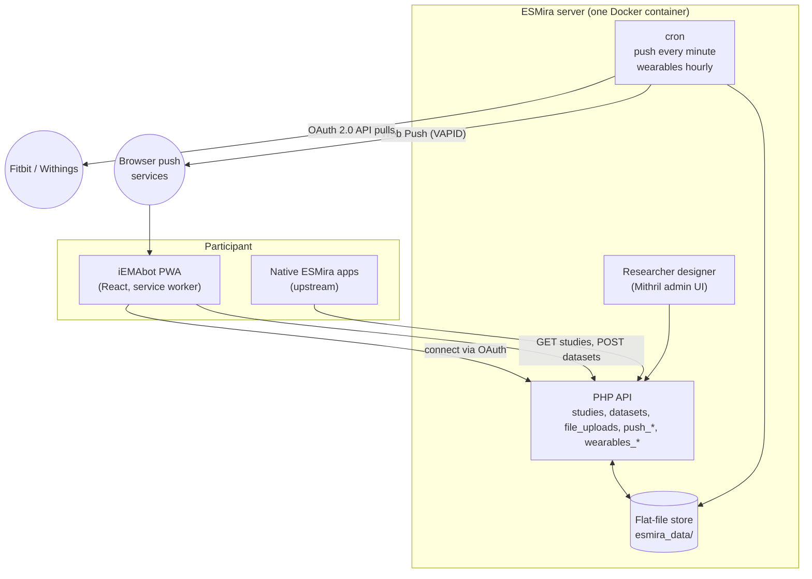

# iEMAbot / ESMira Fork

**iEMAbot** is an open-source Ecological Momentary Assessment (EMA) framework for circadian and sleep
research. It is built on [ESMira](https://github.com/KL-Psychological-Methodology/ESMira), a
self-hosted EMA platform developed by KL Psychological Methodology, and extends it with:

- an installable, chat-style **participant PWA** (`web-pwa/`) that works in any modern browser,
- **Web Push** reminders driven by ESMira's own schedule model,
- **wearable linking** (Fitbit, Withings) over OAuth 2.0, with researcher-side export,
- participant-side **voice memos**, a **keystroke-dynamics typing fallback**, embedded **cognitive tasks**, and
- an automated **WCAG 2.2 accessibility audit** gating every deploy.

This site documents the basic features of the ESMira backend and the PWA, and concentrates on the parts
where **this fork diverges from the upstream repository**.

## How to read this documentation

Every feature carries one of three status badges. They describe what is in the code **today**, not what is
planned.

| Badge | Meaning |
| --- | --- |
| Shipped | Implemented in this repository and used in the reference deployment. |
| Partial | Some of the behaviour exists; the page states precisely which part. |
| TBC | Not implemented (or not verified). The page holds a placeholder so the gap is explicit rather than hidden. |

:::info[Why the placeholders?]
The project abstract makes several promises. Where the code does not yet back one up, this site says so
instead of omitting it. See **[Current status](./current-status.md)** for a claim-by-claim table, and
the **[Roadmap / TBC](./roadmap.md)** page for the open items.
:::

## Where to start

| If you are… | Read |
| --- | --- |
| Evaluating the project against the abstract | [Current status](./current-status.md) |
| Familiar with upstream ESMira and want the delta | [Fork divergence](./fork-divergence.md) |
| A researcher designing a study | [Study model](./backend/study-model.md), [Scheduling](./backend/scheduling.md), [Question types](./pwa/question-types.md) |
| Setting up reminders or wearables | [Web Push](./backend/web-push.md), [Wearables](./backend/wearables.md) |
| Running a server | [Docker and cron](./deployment/docker-and-cron.md), [CI and release](./deployment/ci-and-release.md) |
| Looking at the participant experience | [PWA overview](./pwa/overview.md), [Participant flow](./pwa/participant-flow.md) |

## Architecture at a glance

There is **no database**: studies, responses, media and tokens live as files under `esmira_data/`
(see [Data and privacy](./backend/data-and-privacy.md)).

## Naming

- **ESMira**: the engine (server, designer, data model). Kept as the engine name throughout.
- **iEMAbot**: the participant-facing brand of this fork (PWA name, invite pages, logo).
- **Upstream**: [`KL-Psychological-Methodology/ESMira-web`](https://github.com/KL-Psychological-Methodology/ESMira-web).
- **Fork**: [`andreifoldes/iEMAbot`](https://github.com/andreifoldes/iEMAbot), the repository this site is built from.

:::note[Point-in-time facts]
Counts and dates on these pages (commit totals, version numbers) are as of **2026-10-06**. The root
`package.json` version at that date is `3.6.16`.
:::
