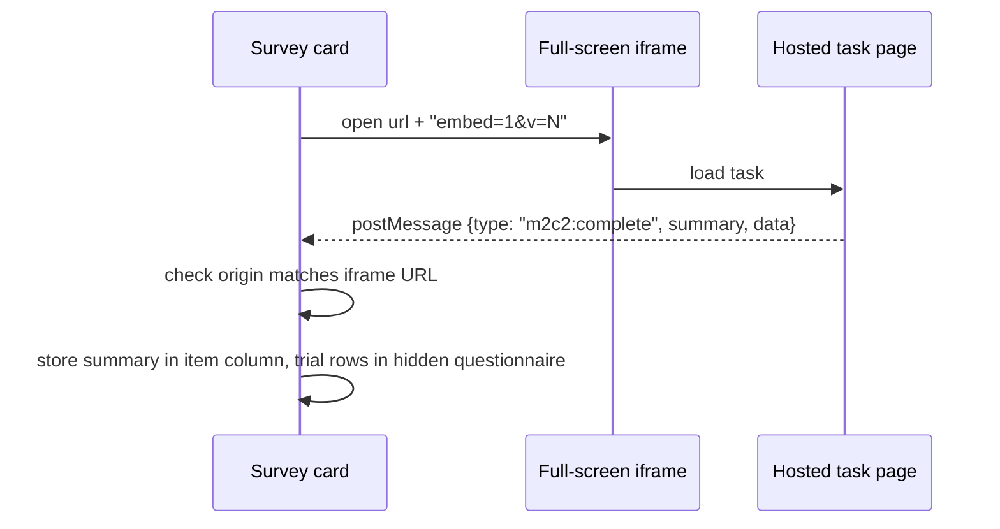

# Cognitive tasks

Shipped embedding and capture ·
Partial the task pages themselves are **not in this repo**

Diurnal variation in cognition is a core use case. The PWA embeds web-based tasks directly in a survey so a
participant never leaves the app.

## The `webapp` input

A first-class `webapp` response type carries a launch `url`, a title (`text`) and a `webappDescription`.
(Legacy: a plain text item containing an `<a href>` is also treated as a cognitive task.)

- The launch URL gets **`embed=1&v=N`** appended. Keep the stored URL **clean**: the adapter adds those
  parameters.
- The iframe is full-screen with `autoplay`, `fullscreen`, `accelerometer` and `gyroscope` allowed.
- Completion arrives as `postMessage` `{type: 'm2c2:complete', summary, data}`; the origin is checked against
  the iframe URL. The participant sees only **"✓ Completed"**, with no performance feedback.
- Each task offers **Start** and **Skip**.

## What is stored

| Where | Content |
| --- | --- |
| The item's own column | Summary JSON `{session, n_trials, duration_s, correct_count}` |
| A hidden questionnaire titled **"Cognitive Trials"** | One row per trial: `cogAssessment`, `cogSource`, `cogInputName`, `cogSession`, `cogTrialIndex`, `cogRt`, `cogCorrect`, `cogResponse`, `cogStimulus`, `cogRaw` |

If the hidden questionnaire does not exist in the study, no per-trial rows are written. Whether it exists in
a given deployment is something to confirm per study.

## Tasks used in the fixtures

Color Shapes, Symbol Search, Prices, a brief Psychomotor Vigilance Test (PVT-BA) and the Affective Slider.
The wrapper pages are served from a separate host (under `/webapp/…`); this repository holds only the
integration.

## Compatible task libraries

Two companion repositories hold the task pages that iEMAbot embeds. Each task is a static page, so any of
them can be used as the `url` of a `webapp` item. A task works inside the PWA when it posts
`m2c2:complete` to the parent frame (see the sequence above).

| Repository | Contents | Notes |
| --- | --- | --- |
| [`m2c2-assessments`](https://github.com/andreifoldes/m2c2-assessments) | Cognitive tasks built on [m2c2kit](https://github.com/m2c2-project/m2c2kit): PVT-BA, SART2, Color Dots, Symbol Search, Grid Memory, Color Shapes, Prices, FNAME, FNAME-Pairs, mVLT. | Every task accepts `token`, `callback_url` and `show_end_screen`. Most accept optional `webcam` and `webgazer` flags. A [URL parameter reference](https://andreifoldes.github.io/m2c2-assessments/docs/) is generated from the task source. |
| [`novel-assessments`](https://github.com/andreifoldes/novel-assessments) | Affective Slider (pleasure × arousal, built on m2c2kit), Reflection (voice memo or free text with a keystroke-timing log) and MoodLine-OS (mood rating with cartoon faces). | Affective Slider and Reflection post `m2c2:complete`. |

:::caution[MoodLine-OS is not drop-in]
MoodLine-OS posts `NOVEL_COMPLETE` rather than `m2c2:complete`, so the PWA does not capture its result when
it is embedded as a `webapp` item. The tasks used in the fixtures (above) are the ones verified end to end;
check that any other task posts `m2c2:complete` before putting it in a live study.
:::

The repositories' READMEs are the source of truth for the current task list and each task's parameters;
this page does not duplicate them.

## Cache-busting rule

The wrapper chain loads `index.html?v=N` → `index.js?v=N` → `task.js?v=N`. The `v=N` value is set **in
`esmiraAdapter.ts`**, and the PWA emits `embed=1&v=N` itself. Consequences:

:::warning[A committed version bump does nothing on its own]
Changing `N` has no effect until the **PWA is rebuilt and redeployed**, because the value is baked into the
bundle. Participants with an installed PWA also need the service worker to update.
:::

Related: the PVT instruction screen defaults `show_tutorial` to true.

## Accessibility note

The cognitive iframe is deliberately **excluded** from the automated accessibility audit, since the content
is third-party task code. See [Accessibility](./accessibility.md).
