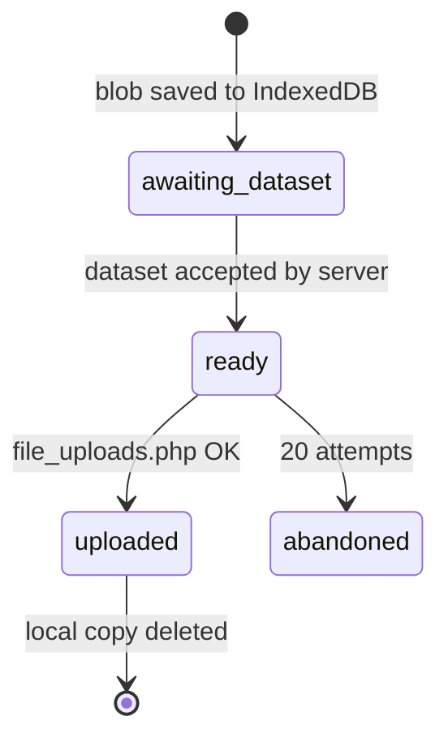

# Offline behaviour and uploads

Shipped

Participants are often on poor connections. The PWA never blocks on the network: it saves locally, then
retries.

## Response queue

Failed `datasets.php` POSTs go into `localStorage` (`esmira_submit_queue`). The queue is flushed on the
browser `online` event, on `visibilitychange`, at app start, and from *Settings → Update studies*. After
**20 failed attempts** an entry is abandoned. The participant sees *"You appear to be offline… will be sent
automatically"*.

## Media uploads (audio and keystrokes)

Media must reach the server **after** its dataset exists, because the file is matched to a response row.

| Store | IndexedDB DB | `dataType` | Payload |
| --- | --- | --- | --- |
| `audioUploads.ts` | `esmira_audio` | `Audio` | Recording blob; filename is an integer identifier |
| `keystrokeUploads.ts` | `esmira_keystrokes` | `Keystrokes` | CSV blob |

## Completion mirror

The service worker cannot read `localStorage`, so `completionMirror.ts` keeps an IndexedDB copy of the
completion log (store `completions`, DB `esmira_state`). The worker uses it to suppress reminders for work
already done; see [Web Push](../backend/web-push.md#suppressing-reminders).

## Upload protocol (visible to participants)

A local log of up to **200 entries** is shown under *Details → Upload protocol* as **Sent** or **Pending**, so
a participant (or a researcher on a support call) can see whether data has left the device.

## Offline study access

`studies.php` is cached `NetworkFirst` (5 s timeout, 30 days, per access key), so a previously opened study
opens without a connection. New study versions are picked up on the next online load or *Update studies*.

## Sign out

*Sign out* clears `localStorage`, the `esmira_state` IndexedDB, Cache Storage, the service worker and the
push subscription, then reloads. **Queued but unsent data is lost** with it.
