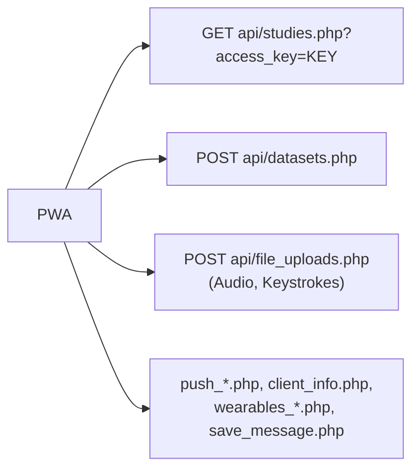

# PWA overview

Shipped · fork-only

The participant app lives in `web-pwa/`. It is a **React 19 + Vite + Tailwind 4** single-page app with a
service worker, presented as a WhatsApp-style thread: one question card at a time, a progress bar, and
rich-text bubbles. It is branded **iEMAbot** in the UI.

:::warning[The PWA's own README is outdated]
`web-pwa/README.md` still states the app makes "no backend changes" and lacks push, scheduling, wearables
and voice. All of those exist now (see [Fork divergence](../fork-divergence.md)). It also gives the base path
as `/esmira/pwa/`; the code uses `/pwa/` with the API root pinned to `/esmira/` (override with
`VITE_API_ROOT`).
:::

## How it talks to ESMira

- **Read:** the study JSON, plus `serverVersion`, `vapidPublicKey` and `wearableProviders`.
- **Write:** responses go to `datasets.php` in the exact shape the native apps use, so the server writes the
  same CSVs. A `joined` event is sent at consent; each completion sends a `questionnaire` event with
  `formDuration` and the user agent as model.
- **Adapter:** `esmiraAdapter.ts` maps ESMira study JSON to the internal survey engine; `surveyEngine.ts`
  runs it. Pages become chat sections (the page header is the divider); `randomized` pages are shuffled per
  session.
- **User ID:** URL parameter (`pid`, `uid`, `user_id` or `userId`) → stored value → random UUID.

## Build and serving

| Item | Value |
| --- | --- |
| Source | `web-pwa/src/` (`App.tsx` holds the flow and modals; `components/`, `lib/`) |
| Build output | `<repo>/dist/pwa/` |
| Vite base | `/pwa/` |
| Build order | Root `npm run build:all` runs the ESMira webpack build **first** (it cleans `dist/`), then the PWA |
| Dev server | `cd web-pwa && npm run dev` (port 5174, proxies `/esmira/api` to `ESMIRA_PROXY`) |
| Tests | `cd web-pwa && npm test` (Node's built-in runner, no dependencies) |
| Type check | `npm run lint` (`tsc --noEmit` for app and worker) |

The Docker image copies `dist/` into the web root, so `/pwa/` is served as static files next to ESMira.

## Manifest and installability

`display: standalone`, portrait, `scope`/`start_url` `/pwa/`, theme colour `#075E54`, 192/512/maskable icons.
The manifest's `start_url` carries no key; in standalone mode the last working invite code is restored from
`localStorage` (`esmira_last_key`). `public/.htaccess` disables caching for `sw.js` and the manifest.

## Service worker

Built with `vite-plugin-pwa` (`injectManifest`, auto-update).

| Concern | Behaviour |
| --- | --- |
| Precache | App shell: js, css, html, svg, png, jpg, ico, woff2. |
| Navigation | SPA fallback to `index.html`, excluding `/esmira/api/`. |
| Study data | `NetworkFirst` for `studies.php`: 5 s timeout, 16 entries, 30 days, keyed per access key. This is how a previously opened study works offline. |
| Fonts | `CacheFirst` for Google Fonts (Inter), one year. |
| Updates | `skipWaiting` + `clientsClaim`; the page reloads on `controllerchange` **only if a controller already existed**, so the first install does not reload. |
| Push | Shows one notification, filters stale/done/duplicate items, posts `received` / `clicked` receipts. See [Web Push](../backend/web-push.md#suppressing-reminders). |
| Legacy cleanup | On startup, unregisters a legacy root-scope (`/`) service worker and deletes `m2c2*` caches. |

## Runtime stack

React 19, Vite 8, Tailwind 4, `motion`, `lucide-react`, TypeScript. `App.tsx` is large (~2,600 lines) because
the whole participant flow and its modals live there.

## Not part of the repo

The cognitive-task wrapper pages are hosted separately; see [Cognitive tasks](./cognitive-tasks.md).
`public/invite-generator.html` is a standalone tool for building bulk invite links
(`?key=…&id=…&pid=…`) with sequential or custom participant IDs.
