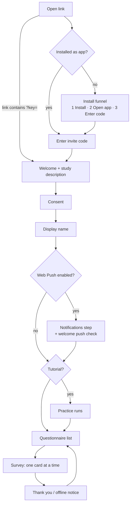

# Participant flow

Shipped

## Invite and install

An invite is a URL with `?key=` (or `access_key`). Without one, the app asks for a code.

**Install-first funnel.** In a plain browser tab the code box is **hidden** and a three-step panel is shown:
*Install the app → Open the installed app → Enter your invite code*. The input appears only in standalone
display mode. A `?key=` URL bypasses the gate. The point is to get participants onto the installed app,
where push works reliably.

`InstallPrompt.tsx` adapts to the browser, using the detection in `lib/pwaInstall.ts`:

| Situation | Guidance |
| --- | --- |
| Install prompt captured (Chromium) | A real **Install app** button. |
| Inside an in-app browser (WhatsApp, Instagram, Facebook, Mail…) | "Open this page in your browser": **Copy link**, then open it in Safari (iOS) or *Open in Chrome* (Android). Web-views can't install a PWA. |
| iOS / iPadOS Safari (16.4+) | Share → **Add to Home Screen**, worded for Safari. |
| iOS / iPadOS Chrome (v113+, iOS 16.4+) | The same, worded for Chrome (Share beside the address bar → *View More*). |
| iOS older than 16.4, Chrome older than v113, or another iOS browser | An amber alert instead of steps: update iOS / Chrome, or open the page in Safari or Chrome. The check **fails open** when a version can't be read (e.g. iPadOS posing as a Mac). |
| macOS Safari | File → **Add to Dock**. |
| Android without a captured prompt | Browser menu → *Install app* / *Add to Home screen*. |
| Desktop Chromium | Address-bar install icon or menu. |
| Unsupported (e.g. desktop Firefox) | "Open in Chrome, Edge or Safari", a **Copy link** button, and the QR code below. |

Around that:

- **Phone handoff.** On a desktop or laptop, *Use your phone instead* reveals a QR code (plus **Copy link**) so
  the participant can carry on from their phone; it is open by default where the desktop browser can't install.
  The QR code is a separate lazy-loaded chunk.
- **After installing.** Once the browser reports the install finished, the install card is replaced by
  *"Added to your Home Screen! Now open iEMAbot from there"*, step 1 of the funnel is ticked and step 2
  becomes the active one. Installing does not turn the current tab into the app, so the participant must open
  the installed icon. A *"Can't see the app after adding it?"* hint explains where iOS and Android put the icon.
- **Invite code on iOS.** The iOS home-screen app starts with empty storage, so a code that arrived as a
  `?key=` link doesn't carry over. When the notifications step sends an iOS participant to install first, the
  code is shown ("Write this down") so they can type it into the installed app. (Android and desktop-Chromium installs
  share storage with the browser, which restores the last working code.)
- **Early prompt capture.** Chromium fires `beforeinstallprompt` once, early. `main.tsx` calls
  `initInstallCapture()` before React mounts and the prompt is held at module level, so screens that mount later
  still get the **Install app** button. The same module owns the single `standalone` check that the funnel,
  the study load and `InstallPrompt` share.

## Consent, name and join time

The study description (HTML) and consent text are shown, then *I consent* / *I do not consent*. The display
name is cosmetic; the participant ID is assigned automatically. **The consent time is the enrolment anchor**
(`esmira_joined_*`, event `joined`), from which `durationStartingAfterDays` and similar fields count.

## Notifications step

Shown only when the study has `webPushEnabled`. The participant chooses *Enable notifications* or
*Continue without notifications*. On enabling, the server sends a welcome push and the app asks
*"Did the notification arrive?"*. A denied permission shows how to unblock it with *Try again*; iOS Safari
before install shows the install card.

## Practice (tutorial) mode

If `enableTutorialMode` is set (and not yet seen, or `?tutorial=1`; `?tutorial=0` suppresses), the app offers
practice runs of every questionnaire. **Nothing is saved or sent** from a practice run.

## Questionnaire list and survey

Available questionnaires are buttons; others are disabled with a lock and a reason such as *Opens at 20:00*.
The header shows *Day N of M*, *Starts [date]*, or *Ended [date]*.

In a survey, one card appears at a time with a progress bar. The footer text box is used only for plain
`text` questions. Optional questions are marked *(Optional)*. After submitting, *"Would you like to complete
another questionnaire?"* appears only if another is actually available now.

**Change response:** by default only the last answer can be changed; `changeResponseMode` can allow any
(`any`) or none (`none`). Cognitive items are never changeable.

## Availability {/* #availability */}

`availability.ts` computes one of: *available, upcoming, ended, completed, locked*, re-evaluated every 60 s
while the app is open.

| Rule | Honoured fields |
| --- | --- |
| Study window | `durationStart` / `durationEnd`, `durationStartingAfterDays`, `durationPeriodDays` (anchored on enrolment, local-day boundaries) |
| Once | `completableOnce` |
| Once per day | `completableOncePerDay`: locks until the next scheduled day (passive questionnaires reopen at midnight) |
| Frequency | `limitCompletionFrequency` / `completionFrequencyMinutes` |
| Per notification | `completableOncePerNotification` with `completableMinutesAfterNotification` as window length |
| Fixed window | `completableAtSpecificTime` start/end |
| Signal windows | From `actionTriggers.schedules` (`dailyRepeatRate`, `weekdays`, `dayOfMonth`, `skipFirstInLoop`, `startDayOne`); a window stays open until end of day unless a timeout is set |
| Passive | No signals: gated only by the duration fields |

## Settings and other screens

| Screen | Content |
| --- | --- |
| Settings | Dark mode, high contrast, reduce motion (defaults to the OS setting), text size (Normal → XX-Large), send error report (with a preview; no survey answers), "Notifications not working?", connect wearables, update studies, About |
| About | App version (root `package.json`), server version, server URL, upstream ESMira link |
| Details | Username, user ID, server URL, joined at, completed questionnaires, next notification, wearables, study description, consent, **upload protocol** (sent / pending) |
| Contact | Free-text message to the researcher via `save_message.php` |
| Sign out | Full local reset, then reload |

:::note[Appearance settings do not persist]
Dark mode, contrast and text size are in-memory state and **reset on reload**.
:::

## Optional device lock

If the URL carries a participant ID parameter, the app calls a same-origin `/api/v1/esmira/pid-lock`
endpoint to keep one device per invite ID, offering *Transfer to this device* or *Use a different code*. That
endpoint belongs to a separate service and **is not part of this repository**; the call fails open on error.
Whether it is live in a given deployment is TBC.
